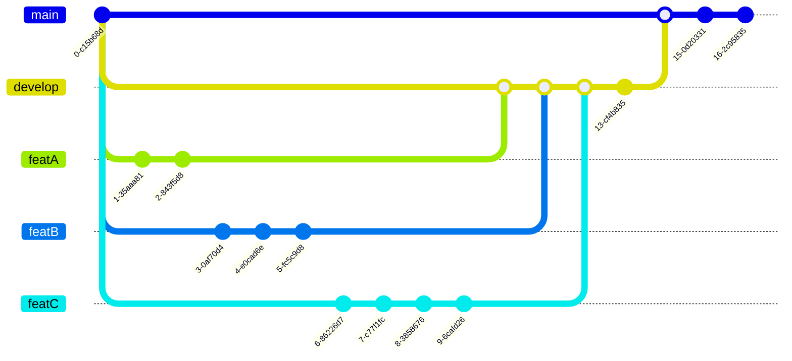
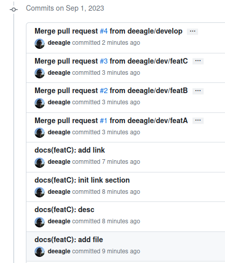

# git-dev-branch

Playground to see commit graph in real.

## To test

The following scenario:

## Mhhhh

Not the nicest git-graph:

The single branches should be updated before merging.
Steps to activate:

- Settings
- Branches
- Protection rules
- [x] Require a pull request before merging
- [x] Require status checks to pass before merging
- [x] Require branches to be up to date before merging

Further details: https://github.blog/changelog/2022-02-03-more-ways-to-keep-your-pull-request-branch-up-to-date/

-> may I must ensure this for explicit topic branches in my environments.
